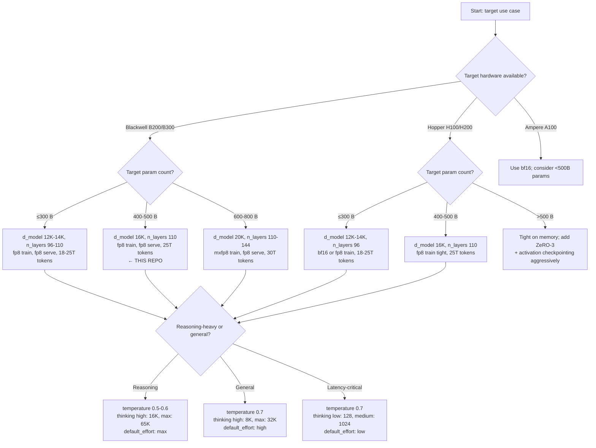

# Permutation & Combination Space — Modelcard-Silent Knobs

`` pins **7** numerical/structural choices. Every other knob in `configs/sota_4_7.yaml` is **operator-committed** — the modelcard is silent. This document enumerates those silent knobs, the realistic permutation range for each, the combinations that *interact* (because their cross-product is what determines outcomes), and worked recipes for hitting specific targets.

It's the answer to "what are my degrees of freedom, and what does flipping each one cost?"

---

## 1. Pinned vs Unpinned (the split)

### 1.1 The 7 modelcard-pinned fields — DO NOT permute

| Pinned field | YAML value | Modelcard evidence |
|---|---|---|
| `max_position_embeddings` | 1,048,576 | 8.7 — 1M tokens (1 hit) |
| `max_context_tokens` | 1,048,576 | 8.7 |
| `vision_max_image_long_edge_px` | 2,576 | invariant — "2576 px" (4 hits) |
| `vision_max_image_pixels` | 3,750,000 | invariant — "3.75 MP" (4 hits) |
| `context_compaction_trigger` | 200,000 | 4.5 — 200k (4 hits) |
| `adaptive_thinking` | `true` | 4.1.1 — adaptive thinking (34 hits) |
| `thinking_budgets` tier names | `min/low/medium/high/max` | 8 evals — Max/High effort |

These are the load-bearing invariants. Changing them invalidates downstream evals (1M context → 8.7 fails; 2576 px → 8.9 fails; etc.).

### 1.2 The ~25 modelcard-silent fields — your degrees of freedom

Grouped by what they control:

```
Architecture        d_model, n_layers, n_q_heads, n_kv_heads, head_dim, ffn_dim,
                    vocab_size, tie_embeddings, sliding_window_size,
                    sliding_window_layer_stride, layer_overrides

Position encoding   rope_base, rope_yarn_scale, rope_yarn_original_max_position

Vision              vision_patch_size, vision_enabled

Optimizer           optimizer (adamw/shampoo/muon), lr, beta1, beta2, weight_decay,
                    grad_clip, warmup_steps, total_steps

Schedule            seq_len, global_batch_tokens, grad_accum, mixed_precision,
                    grad_checkpointing, zero_stage, tp_degree, pp_degree

Sampling            temperature, top_p, top_k, repetition_penalty,
                    max_new_tokens, kv_cache_dtype, page_block_size

Thinking            thinking_budgets values, thinking_token_min_floor

Implied scale       total_tokens_trillions, source_mix_pct, training_flops_band,
                    pretraining_blackwell_hours_band, pretraining_dollar_band_usd
```

Each row in §3-§5 below explores one or more of these.

---

## 2. Single-knob permutations (one variable at a time)

For each silent knob: 2024 typical → 2025-2026 frontier → 2027+ projection → this repo. "Knob" rows are sortable independently of each other. The "Affects" column is the most direct downstream consequence.

### 2.1 Architecture (shape) knobs

| Knob | 2024 typical | 2026 frontier | 2027+ projection | This repo | Affects |
|---|---|---|---|---|---|
| `vocab_size` | 32K–128K | 128K–256K | 256K | 200K | embed/head params; multilingual compression |
| `d_model` | 8K–16K | 14K–20K | 20K–24K | 16,384 | width; capability ceiling; KV per layer |
| `n_layers` | 60–96 | 100–180 | 150–240 | 110 | depth; reasoning; wall-clock |
| `n_q_heads` | 32–64 | 96–160 | 128–256 | 128 | attention head count |
| `n_kv_heads` (GQA) | 4–8 | 8–16 | 8–16 (or MLA) | 16 | KV-cache memory |
| `head_dim` | 64–128 | 128 | 128 | 128 | per-head capacity (rarely changed) |
| `ffn_dim` (× d_model) | 2.7–4.0 | 3.5–4.0 | 3.5–4.0 | 4.0 | FFN params |
| `tie_embeddings` | sometimes | rarely (frontier) | rarely | `false` | saves ~vocab×d_model params |
| `sliding_window_size` | 4K–8K | 16K–32K | 32K–64K | 32,768 | windowed-layer KV bound |
| `sliding_window_layer_stride` | 2–4 | 2–4 | 2 | 2 | fraction of layers windowed |

### 2.2 Position-encoding knobs

| Knob | 2024 | 2026 | 2027+ | This repo | Affects |
|---|---|---|---|---|---|
| `rope_base` | 10⁴–10⁶ | 10⁶ | 10⁶–10⁷ | 1,000,000 | long-context generalization |
| `rope_yarn_scale` | 1–4 | 4–16 | 16–32 | 8 | how far past training len you can extrapolate |
| `rope_yarn_original_max_position` | 4K–8K | 8K | 8K–32K | 8,192 | YaRN cutoff frequency |

### 2.3 Optimizer knobs

| Knob | 2024 | 2026 | 2027+ | This repo | Notes |
|---|---|---|---|---|---|
| `optimizer` | adamw | adamw | adamw / shampoo / muon | `adamw` | Shampoo emerging at Google scale |
| `lr` (peak) | 1e-4–3e-4 | 1e-4–3e-4 | 1e-4–3e-4 | 3e-4 | scale by `1/sqrt(width)` if changing d_model |
| `beta1` | 0.9 | 0.9 | 0.9 | 0.9 | unchanged across eras |
| `beta2` | 0.95–0.999 | 0.95 | 0.95 | 0.95 | lower for stage transitions |
| `weight_decay` | 0.05–0.1 | 0.1 | 0.1 | 0.1 | stable |
| `grad_clip` | 0.5–1.0 | 1.0 | 1.0 | 1.0 | fp8 sometimes wants 0.5 |
| `warmup_steps` | 500–4K | 1K–4K | 1K–4K | 2,000 | ~0.2% of total |

### 2.4 Schedule knobs

| Knob | 2024 | 2026 | 2027+ | This repo | Affects |
|---|---|---|---|---|---|
| `seq_len` (stage 1) | 4K–8K | 8K | 8K–16K | 8,192 | per-step compute |
| `global_batch_tokens` | 2M–8M | 4M–16M | 16M–64M | 4,194,304 (4M) | sample efficiency |
| `grad_accum` | 8–32 | 8–32 | 8–32 | 16 | global batch tuner |
| `mixed_precision` | bf16 | fp8 | fp8 / mxfp8 | `fp8` | hardware-coupled |
| `total_steps` | 1M–4M | 1M–8M | 4M–16M | 1,000,000 | wall-clock / token budget |

### 2.5 Sampling knobs

| Knob | Range | This repo | Notes |
|---|---|---|---|
| `temperature` | 0.0–1.5 | 0.7 | 0 = greedy; 1 = pure softmax; reasoning often 0.5–0.6 |
| `top_p` | 0.5–1.0 | 0.95 | mass cutoff; 1.0 = no cut |
| `top_k` | 1–512 | 40 | hard cut on candidate count |
| `repetition_penalty` | 1.0–1.3 | 1.1 | >1 discourages repeats |
| `max_new_tokens` | 256–32K | 8,192 | answer cap |
| `kv_cache_dtype` | fp8/bf16/int8/fp4 | `fp8` | see [PRECISION.md](./PRECISION.md) |
| `page_block_size` | 8–64 | 16 | paged attention block size |

### 2.6 Thinking-budget knobs

| Effort tier | Range | This repo | Notes |
|---|---|---|---|
| `thinking_budgets.min` | 0 | 0 | always; `min` = no thinking |
| `thinking_budgets.low` | 64–512 | 256 | quick scratchpad |
| `thinking_budgets.medium` | 1K–4K | 2,048 | standard reasoning |
| `thinking_budgets.high` | 4K–16K | 8,192 | hard math/code |
| `thinking_budgets.max` | 16K–64K | 32,768 | competition-level |
| `thinking_token_min_floor` | 16–128 | 32 | floor regardless of effort logit |

---

## 3. Combinations that interact (the math)

This is the heart of the doc. Knobs don't move independently — their cross-products determine outcomes. Six master equations:

### 3.1 Param count

```
P =   vocab_size × d_model                                         (input embed)
  + n_layers × [
        d_model × n_q_heads × head_dim     × 2                     (q_proj + o_proj)
      + d_model × n_kv_heads × head_dim    × 2                     (k_proj + v_proj)
      + d_model × ffn_dim                  × 3                     (SwiGLU gate + up + down)
      + 2 × d_model                                                 (2× RMSNorm)
    ]
  +   vocab_size × d_model                                         (output head, if untied)
```

With the YAML defaults: **427.3B**.

#### 3.1.1 Sensitivity to each knob, holding others fixed

Starting from defaults (P = 427.3B), how does P change if you nudge one knob:

| Knob | Δknob | ΔP | ΔP / Δ% |
|---|---|---|---|
| `d_model`      | 16384 → 14336 (−12.5%) | −51 B | −12% |
| `d_model`      | 16384 → 20480 (+25%)   | +118 B | +28% |
| `n_layers`     | 110 → 84 (−24%)         | −99 B | −23% |
| `n_layers`     | 110 → 144 (+31%)        | +130 B | +30% |
| `ffn_dim`      | 65536 → 49152 (−25%)    | −89 B | −21% |
| `ffn_dim`      | 65536 → 81920 (+25%)    | +89 B | +21% |
| `vocab_size`   | 200K → 128K (−36%)      | −2.3 B | −0.5% |
| `n_q_heads`    | 128 → 96 (−25%)         | −18 B | −4% |
| `n_kv_heads`   | 16 → 8 (−50%)           | −2 B | −0.5% |

**Highest leverage:** `n_layers`, `d_model`, `ffn_dim`, in that order. **Lowest leverage:** `n_kv_heads`, `vocab_size`. A tornado-style takeaway: changing depth × 1.3 changes params more than changing vocab × 1.5.

#### 3.1.2 Combinations that hit a target P

Worked grid for picking (`d_model`, `n_layers`, `ffn_dim`) at fixed vocab=200K, n_q=128, n_kv=16, head_dim=128, untied:

| `d_model` | `n_layers` | `ffn_dim` | `ffn_dim/d_model` | P (B) | Use case |
|---|---|---|---|---|---|
| 12288 | 80  | 49152  | 4.0 | ~187 B | "200B target" |
| 12288 | 96  | 49152  | 4.0 | ~219 B | 200B target, deeper |
| 14336 | 96  | 57344  | 4.0 | ~318 B | mid-band |
| 16384 | 96  | 65536  | 4.0 | ~378 B | shallower than this repo |
| 16384 | 110 | 49152  | 3.0 | ~345 B | **tapered (preset)** |
| 16384 | 110 | 65536  | 4.0 | **427 B** | **this repo, uniform** |
| 16384 | 144 | 65536  | 4.0 | ~553 B | deeper |
| 18432 | 110 | 73728  | 4.0 | ~534 B | wider |
| 20480 | 110 | 81920  | 4.0 | ~657 B | "600B target" |
| 20480 | 144 | 81920  | 4.0 | ~853 B | "850B frontier" |

**Recipe to land at any P target (uniform layers):**

```
1. Pick d_model from {12288, 14336, 16384, 18432, 20480}.
2. Pick ffn_dim = 4 × d_model (frontier convention).
3. Solve for n_layers:
     P_per_layer ≈ d_model × (n_q × head_dim × 2 + n_kv × head_dim × 2 + ffn_dim × 3)
     n_layers ≈ (P_target − P_embed_head) / P_per_layer
4. If n_layers ends up outside [80, 180], adjust d_model.
```

For per-layer heterogeneity (tapered FFN), use `tapered_ffn_overrides` — see [`README.md` §1.2.1](../README.md#121-per-layer-heterogeneity-not-all-layers-are-the-same).

### 3.2 KV cache memory per token

```
KV_per_token = 2 (K+V) × n_layers × n_kv_heads × head_dim × bytes_per_element
```

With the YAML defaults at bf16: **901,120 bytes ≈ 880 KB/token**.

#### 3.2.1 Cross-product: (n_kv_heads × dtype) at fixed n_layers=110, head_dim=128

| `n_kv_heads` | dtype | KB/token | KV at 256K | KV at 1M | KV at 10M |
|---|---|---:|---:|---:|---:|
| 8  | bf16 | 440  | 110 GB | 440 GB | 4.4 TB |
| 8  | fp8  | 220  | 55 GB  | 220 GB | 2.2 TB |
| 8  | int4 | 110  | 28 GB  | 110 GB | 1.1 TB |
| **16** | **bf16** | **880**  | **220 GB** | **880 GB** | **8.8 TB** |
| 16 | fp8  | 440  | 110 GB | 440 GB | 4.4 TB |
| 16 | int8 | 440  | 110 GB | 440 GB | 4.4 TB |
| 16 | fp4  | 220  | 55 GB  | 220 GB | 2.2 TB |
| 32 | bf16 | 1760 | 440 GB | 1.76 TB | 17.6 TB |

**Frontier-dense ships at the bold row by default.** Halving `n_kv_heads` to 8 cuts KV cost in half but loses some long-context retrieval (cf. modelcard 8.7 GraphWalks at 1M); halving precision (fp8 instead of bf16) is the cheaper win.

#### 3.2.2 Recipe to fit a 1M-context budget

Goal: KV at 1M ≤ 256 GB (fits in 2 × B200 192 GB or 4 × A100 80 GB).

```
KV_at_1M (GB) = 2 × n_layers × n_kv × head_dim × bytes × 1e6 / 1e9
              = n_layers × n_kv × head_dim × bytes / 500

Solve for bytes ≤ 256 / (n_layers × n_kv × head_dim / 500)
```

Two recipes that hit ≤ 256 GB:

- `n_layers=110, n_kv=16, head_dim=128, dtype=int4` (4 bits) → 220 GB ✓
- `n_layers=110, n_kv=8,  head_dim=128, dtype=fp8`  (8 bits) → 220 GB ✓
- `n_layers=110, n_kv=16, head_dim=128, dtype=fp4`  (4 bits) → 220 GB ✓
- `n_layers=110, n_kv=16, head_dim=128, dtype=bf16` → 880 GB ✗

### 3.3 Training compute (Chinchilla)

```
F_train ≈ 6 × N × D
where N = total params, D = total training tokens
```

#### 3.3.1 Cross-product: (P × tokens) → FLOPs

| P (B) | Tokens (T) | FLOPs | Band ref | Wall-clock |
|---|---|---|---|---|
| 200 | 15  | 1.8 × 10²⁵ | "10²⁵ entry" | ~12 weeks @ 1k H100 |
| 200 | 25  | 3.0 × 10²⁵ | mid 10²⁵ | ~16 weeks |
| 427 | 18  | 4.6 × 10²⁵ | mid 10²⁵ | ~22 weeks |
| **427** | **25**  | **6.4 × 10²⁵** | **upper 10²⁵ — this repo** | **~24 weeks @ 2k H100, ~16 weeks @ 2k B200 (fp8)** |
| 427 | 40  | 1.0 × 10²⁶ | 10²⁶ | ~32 weeks |
| 600 | 30  | 1.1 × 10²⁶ | 10²⁶ | ~34 weeks |
| 700 | 35  | 1.5 × 10²⁶ | 10²⁶ | ~42 weeks |
| 1000 | 40 | 2.4 × 10²⁶ | upper 10²⁶ | ~60 weeks |

#### 3.3.2 Chinchilla-optimal vs frontier-overtrained

The published Chinchilla scaling law says **D ≈ 20 × N is compute-optimal**:

| P (B) | D_chinchilla (T) | D_frontier (T) | Overtrain ratio |
|---|---:|---:|---|
| 200 | 4.0  | 15–25 | 4–6× |
| 427 | 8.5  | 25    | 3× |
| 700 | 14.0 | 30–35 | 2–2.5× |

Frontier-dense **overtrains** because compute is cheaper than the marginal eval gain at the optimal point — DeepSeek-V3 trained for 14.8T at 671B (overtrained 2.5×); Llama 3 405B trained for 15T (overtrained 9×). The 25T/427B in this repo lands at ~3× overtrain.

### 3.4 GPU memory at training (per replica)

```
M_train = M_params + M_grads + M_optimizer + M_activations
        = N × b_fp32        (master weights, fp32)
        + N × b_bf16        (gradients, bf16)
        + N × 2 × b_fp32    (Adam m + v, fp32)
        + activation_memory(seq_len, batch_size, n_layers, d_model)

with ZeRO-3: M_params, M_grads, M_optimizer all sharded across DP replicas
```

For 427B params with bf16 mixed + fp32 master + Adam + ZeRO-3 across 16 DP ranks:

| Component | Per replica (GB) |
|---|---:|
| Sharded fp32 master weights | 107 |
| Sharded bf16 gradients      | 53 |
| Sharded fp32 Adam state (m, v) | 214 |
| Activations (seq=8192, mb=1, with grad-ckpt) | ~30 |
| **Total** | **~404 GB / replica** |

Spread across TP=8 within the replica → ~50 GB per GPU. Fits on H100/B200. Without grad checkpointing activations balloon ~6×.

### 3.5 Inference memory at deployment

```
M_serve = M_weights + M_kv_cache + M_activations
```

For 427B at 1M context:

| Precision (weights / KV) | Weights (GB) | KV at 1M (GB) | Total | Min GPUs |
|---|---:|---:|---:|---|
| bf16 / bf16 | 855 | 880 | 1735 | 12 × A100-80 (TP=8 PP=2 × 1.5) |
| bf16 / int8 | 855 | 440 | 1295 | 8 × A100-80 |
| fp8 / fp8   | 428 | 440 | 868  | 4 × B200-192 |
| fp8 / fp4   | 428 | 220 | 648  | 4 × B200-192 |
| int4 / int4 | 214 | 220 | 434  | 2 × B200-192 |

### 3.6 Token throughput cost

```
Cost_per_M_output_tokens ≈ (GPU_$/hr × n_GPUs) / (output_tokens/sec × 3.6)
```

Order-of-magnitude pricing (2026): B200 ≈ $4/hr, H100 ≈ $2/hr, A100 ≈ $1/hr.

For a 4× B200 replica generating ~80 tokens/sec/user across 16 concurrent users:
- 1280 tokens/sec total → 4.6M tokens/hr
- $16/hr / 4.6M tok/hr = **$3.5 per M output tokens**

This is what determines the public API price band. Operators tune the tradeoff: int4 weights cuts cost ~50% but loses honesty calibration ~1pp.

---

## 4. Worked recipes — landing specific targets

Each recipe bundles all the knobs that move together for a goal.

### 4.1 "I want a 200B-class dense model" (compact frontier)

```yaml
model:
  vocab_size: 200000
  d_model: 12288             # smaller than this repo
  n_layers: 96               # shallower
  n_q_heads: 96
  n_kv_heads: 12             # 8:1 GQA
  head_dim: 128
  ffn_dim: 49152             # 4 × d_model
  layer_overrides: {}        # uniform; tapering would land at ~165B

# Estimated: 219 B params
training:
  mixed_precision: fp8
  global_batch_tokens: 4194304
implied_training_corpus:
  total_tokens_trillions: 18  # Chinchilla overtrained ~4×
implied_compute:
  training_flops_band: "2.4 × 10^25"
```

### 4.2 "Frontier-dense at 600B" (Llama-4-class dense)

```yaml
model:
  vocab_size: 200000
  d_model: 20480
  n_layers: 110
  n_q_heads: 160
  n_kv_heads: 20
  head_dim: 128
  ffn_dim: 81920             # 4 × d_model

# Estimated: 657 B params
training:
  mixed_precision: fp8
  global_batch_tokens: 8388608  # 8M, scales with model
implied_training_corpus:
  total_tokens_trillions: 30
```

### 4.3 "This repo's default — 427B" (the YAML as shipped)

```yaml
model:
  vocab_size: 200000
  d_model: 16384
  n_layers: 110
  n_q_heads: 128
  n_kv_heads: 16
  head_dim: 128
  ffn_dim: 65536
  layer_overrides: {}

# Exactly: 427.3 B params
training:
  mixed_precision: fp8
implied_training_corpus:
  total_tokens_trillions: 25
```

### 4.4 "I have a fixed compute budget of 10^25 FLOPs"

Solve for compute-optimal vs frontier-overtrained:

```
Chinchilla-optimal:    P ≈ 64 B,  D ≈ 1.3 T tokens
Frontier-overtrained:  P ≈ 220 B, D ≈ 7.6 T tokens   (3× overtrain)
```

The frontier path takes ~3× more wall-clock for the same FLOPs (deeper net forward), but each parameter's loss-bits-per-flop is higher because the model is closer to its capacity ceiling on the given data.

### 4.5 "Memory-tight inference on 4× A100-80"

```yaml
inference:
  kv_cache_dtype: int8       # halve KV memory
  page_block_size: 16
  max_context_tokens: 200000  # not the full 1M — match the 200k compaction trigger
  enable_prefix_cache: true
```

Combined with weight-only int4 (AWQ/GPTQ) you can fit a 427B serving worker on 4× A100-80 at 200K context, ~10 tokens/sec/user.

### 4.6 "Reasoning-heavy assistant" (lower temperature, longer thinking)

```yaml
inference:
  temperature: 0.55     # was 0.7
  top_p: 0.92            # was 0.95
  default_effort: max
  thinking_visible_to_user: false
model:
  thinking_budgets:
    high: 16384          # was 8192
    max: 65536           # was 32768
```

### 4.7 "Latency-critical chatbot" (small thinking budget, default temperature)

```yaml
inference:
  temperature: 0.7
  top_p: 0.95
  default_effort: low
  max_new_tokens: 2048
model:
  thinking_budgets:
    low: 128             # was 256
```

---

## 5. Sensitivity analysis (tornado chart equivalent)

For each downstream metric, which knob has the biggest leverage? Higher = more sensitive.

### 5.1 Param count sensitivity

```
Knob              Δknob = ±25%   ΔP / Δknob (rough)
─────────────────────────────────────────────────
n_layers          ±27 layers     ~ ±1.0×
ffn_dim           ±16K           ~ ±0.85×
d_model           ±4K            ~ ±1.2×    (quadratic in attention; linear-and-quadratic in FFN)
n_q_heads         ±32 heads      ~ ±0.15×
vocab_size        ±50K           ~ ±0.03×
n_kv_heads        ±4 heads       ~ ±0.005×  (nearly invisible at frontier scale)
head_dim          ±32            ~ ±0.20×
```

`d_model`, `n_layers`, `ffn_dim` are the three knobs operators actually tune for param targets. The rest are fixed by other constraints (KV-cache layout, vocab-coverage targets).

### 5.2 KV-cache sensitivity at 1M context

```
Knob              Δknob          ΔKV(1M) leverage
─────────────────────────────────────────────────
n_layers          ±27 layers     ±1.0×
n_kv_heads        ±8 heads       ±1.0×
head_dim          ±64            ±1.0×
dtype             bf16→fp8       ÷2
dtype             bf16→int4      ÷4
sliding_window    32K→8K          (only on windowed layers; halves their KV)
```

At 1M, dtype is the highest-leverage knob — switching bf16 → fp4 cuts KV cost by 4× without changing architecture.

### 5.3 Training-cost sensitivity

```
Knob                  Δknob          ΔFLOPs leverage
────────────────────────────────────────────────────
total_tokens          ±10T           ±1.0×
total params          ±100B          ±1.0×
mixed_precision       bf16→fp8       0× FLOPs, ÷2 wall-clock on Blackwell
seq_len               2× (8K→16K)    ±0.3× (more attention compute)
global_batch_tokens   ±2×            0× FLOPs (just changes step count)
zero_stage            2→3            0× FLOPs, halves memory
```

FLOPs are determined by `(P × D)`. Wall-clock additionally depends on hardware × precision.

### 5.4 Inference-quality sensitivity

```
Knob                Δknob           Quality impact
─────────────────────────────────────────────────
weight precision    bf16→int8       <0.5pp on most evals
weight precision    bf16→int4       1–3pp loss without AWQ; ~0.5pp with AWQ
KV precision        bf16→fp8        <0.2pp (calibrated)
KV precision        bf16→int8       <0.5pp; ~1pp on MASK / honesty
KV precision        bf16→fp4/int4   2–5pp without MX scaling
temperature         0.7→0.5         marginally better reasoning, marginally worse creativity
top_p               0.95→0.85       sometimes 1pp better on reasoning, more refusals
thinking_budget     2k→8k tokens    +3–8pp on hard math/code (modelcard 8.4–8.6)
```

---

## 6. Decision matrix — picking a recipe by constraint

Given (target_param_count, target_context, target_hardware, target_cost_band), the matrix below points at the right recipe.

### 6.1 Pick by `(target_param_count, target_hardware)`

| Target P | A100 (Ampere) | H100 (Hopper) | B200 (Blackwell) |
|---|---|---|---|
| 200B | bf16 train; bf16/int8 serve | bf16 or fp8 train; fp8 serve | fp8 train; fp8 serve |
| 400B | bf16 train (slow); int8 serve | bf16/fp8 train; fp8 serve | fp8 train; fp8 serve  ← this repo |
| 700B | not feasible (memory) | fp8 train (tight); fp8 serve | fp8 train; fp8/mxfp8 serve |
| 1T+ | not feasible | fp8 train (very tight) | fp8/mxfp8 train; mxfp4 serve |

### 6.2 Pick by `(target_context, target_hardware)` — for fixed 427B params

| Target ctx | A100 80 GB | H100 80 GB | B200 192 GB |
|---|---|---|---|
| 200K | 4 GPUs, int8 KV | 4 GPUs, fp8 KV | 2 GPUs, fp8 KV |
| 1M   | 8 GPUs, int8 KV | 8 GPUs, fp8 KV | 4 GPUs, fp8 KV |
| 10M (compaction) | 16 GPUs, int4 KV + compaction at 200K | 16 GPUs, fp8 KV + compaction | 8 GPUs, fp8/fp4 KV + compaction |

### 6.3 Pick by `(target_TTFT_p99, target_TPOT_p99)` — public API SLA

| TTFT p99 (sec) | TPOT p99 (sec) | Required setup |
|---|---|---|
| ≤ 2 | ≤ 0.05 | 8 × B200, fp8 weights + fp8 KV, prefix cache, FlashAttention 3 |
| ≤ 5 | ≤ 0.1  | 16 × H100, fp8 weights + int8 KV |
| ≤ 10 | ≤ 0.2 | 8 × A100, int8 weights + int8 KV |

---

## 7. The full enumeration table (every silent knob, every band)

For ctrl-F lookup and audit. One row per silent knob; "Lower band" / "Upper band" are the realistic operator-commit corners; "Step" is the unit you'd nudge by in a sensitivity sweep.

| Category | Knob | Lower band | This repo | Upper band | Step | Affects |
|---|---|---|---|---|---|---|
| Arch | `vocab_size` | 64K | 200K | 256K | ±32K | embed/head params; multilingual |
| Arch | `d_model` | 8192 | 16384 | 24576 | ±2048 | width; attn/ffn cost |
| Arch | `n_layers` | 60 | 110 | 240 | ±8 | depth |
| Arch | `n_q_heads` | 32 | 128 | 256 | ±16 | attention |
| Arch | `n_kv_heads` | 4 | 16 | 32 | ±4 | KV memory |
| Arch | `head_dim` | 64 | 128 | 192 | ±32 | per-head capacity |
| Arch | `ffn_dim` | 16K | 65K | 96K | ±4K | FFN params |
| Arch | `tie_embeddings` | true | false | false | bool | saves vocab×d_model |
| Arch | `sliding_window_size` | 4K | 32K | 65K | ±8K | windowed-layer KV |
| Arch | `sliding_window_layer_stride` | 2 | 2 | 4 | ±1 | windowed fraction |
| Pos | `rope_base` | 10K | 1M | 10M | ×10 | long-context |
| Pos | `rope_yarn_scale` | 1 | 8 | 32 | ×2 | YaRN extrap |
| Pos | `rope_yarn_original_max_position` | 4K | 8K | 32K | ×2 | YaRN cutoff |
| Vision | `vision_patch_size` | 14 | 14 | 16 | ±2 | image tokens |
| Vision | `vision_enabled` | false | true | true | bool | multimodal |
| Opt | `optimizer` | adamw | adamw | shampoo/muon | enum | convergence |
| Opt | `lr` | 1e-4 | 3e-4 | 5e-4 | ±50% | training speed |
| Opt | `beta1` | 0.9 | 0.9 | 0.95 | ±0.05 | momentum |
| Opt | `beta2` | 0.95 | 0.95 | 0.999 | ±0.05 | adam decay |
| Opt | `weight_decay` | 0.05 | 0.1 | 0.2 | ±0.05 | regularization |
| Opt | `grad_clip` | 0.5 | 1.0 | 2.0 | ±0.5 | stability |
| Opt | `warmup_steps` | 500 | 2000 | 8000 | ×2 | warmup |
| Sched | `seq_len` (stage 1) | 4096 | 8192 | 16384 | ×2 | per-step compute |
| Sched | `global_batch_tokens` | 2M | 4M | 16M | ×2 | sample efficiency |
| Sched | `grad_accum` | 4 | 16 | 64 | ×2 | global batch |
| Sched | `mixed_precision` | fp32 | fp8 | mxfp8 | enum | hardware |
| Sched | `total_steps` | 500K | 1M | 8M | ×2 | token budget |
| Sample | `temperature` | 0.0 | 0.7 | 1.5 | ±0.1 | exploration |
| Sample | `top_p` | 0.5 | 0.95 | 1.0 | ±0.05 | mass cutoff |
| Sample | `top_k` | 1 | 40 | 512 | ×2 | candidate cap |
| Sample | `repetition_penalty` | 1.0 | 1.1 | 1.3 | ±0.05 | repeat suppression |
| Sample | `max_new_tokens` | 256 | 8192 | 32K | ×2 | answer length |
| Sample | `kv_cache_dtype` | fp32 | fp8 | fp4 | enum | KV memory |
| Sample | `page_block_size` | 8 | 16 | 64 | ×2 | paged attn block |
| Think | `thinking_budgets.low` | 64 | 256 | 1024 | ×2 | quick scratchpad |
| Think | `thinking_budgets.medium` | 1024 | 2048 | 8192 | ×2 | reasoning |
| Think | `thinking_budgets.high` | 4096 | 8192 | 32768 | ×2 | hard problems |
| Think | `thinking_budgets.max` | 16K | 32K | 65K | ×2 | competitions |
| Think | `thinking_token_min_floor` | 16 | 32 | 128 | ×2 | floor |
| Implied | `total_tokens_trillions` | 10 | 25 | 50 | ±5 | training tokens |
| Implied | `source_mix_pct.web` | 30 | 45 | 60 | ±5 | web fraction |
| Implied | `source_mix_pct.code` | 10 | 20 | 30 | ±5 | code fraction |
| Implied | `source_mix_pct.math_structured` | 5 | 10 | 20 | ±5 | math fraction |

---

## 8. Quick orientation — flowchart for picking knobs



---

## 9. Cross-references

- For precision details (fp8 / bf16 / int8 / fp4 / MXFP4 / hardware support): [`docs/PRECISION.md`](./PRECISION.md)
- Per-layer heterogeneity (`layer_overrides`, `tapered_ffn_overrides`, `hybrid_attention_overrides`): [`README.md` §1.2.1](../README.md#121-per-layer-heterogeneity-not-all-layers-are-the-same)
- Modelcard-pinned invariants (the 7 untouchables): [`CLAUDE.md` "Key invariants"](../CLAUDE.md)
- Live diagnostic of any combination:

  ```python
  from sota_model.config import ModelConfig, tapered_ffn_overrides
  cfg = ModelConfig(d_model=20480, n_layers=110, ffn_dim=81920)
  print(f"{cfg.estimate_params_billions():.1f} B")
  for row in cfg.per_layer_param_breakdown()[:3]:
      print(row)
  ```
