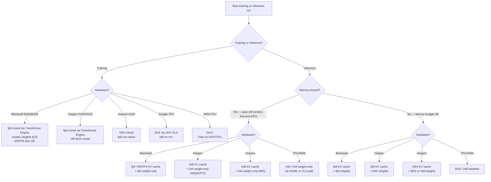

# Numeric Precision Formats — fp32 → bf16 → fp8 → fp4 / MXFP4

This document explains every precision format the SOTA dense model touches, in order of decreasing bit-width, with hardware support across NVIDIA / Google TPU / ARM, code pointers into this repo, and a decision flowchart for "which precision should I pick?".

It is structured as **simple → intermediate → expert**. Read top-to-bottom; stop wherever it stops being relevant.

---

## 1. Simple intuition

Computers represent real numbers with a fixed number of bits. **Fewer bits = less memory, faster math, but less accuracy.** Modern frontier-dense models mix several formats in the same training run:

```
                  more bits ───────────────────────────► fewer bits
                  more accurate                          less memory, faster

  fp32 ──► bf16 ──► fp16 ──► fp8 (E4M3 / E5M2) ──► int8 ──► fp4 / MXFP4
   32       16       16          8                    8        4
   bits     bits     bits        bits                 bits     bits
```

A frontier-dense pretraining run in 2026 typically uses:
- **fp32** as the master copy of weights and as the matmul accumulator.
- **fp8** (Blackwell) or **bf16** (Hopper) for activations and tensor-core matmuls.
- **int8** or **fp4 / MXFP4** for the KV cache and weight-only quantization at deployment.

The same model is trained at one precision and served at another, with explicit conversion at every boundary.

---

## 2. The formats, side by side

| Format | Bits | Sign | Exponent | Mantissa | Approx range | Smallest gap | Used for |
|---|---:|:---:|:---:|:---:|---|---|---|
| `fp32`        | 32 | 1 | 8 | 23 | ±10³⁸                  | 1.2e-7 | reference, accumulators, master weights |
| `tf32`        | 19* | 1 | 8 | 10 | ±10³⁸ | ~1e-3 | NVIDIA-only matmul shortcut (32-bit storage, 19-bit compute) |
| `fp16`        | 16 | 1 | 5 | 10 | ±65 504               | 9.8e-4 | legacy training; obsolete for new runs |
| `bf16`        | 16 | 1 | 8 | 7  | ±10³⁸                  | 7.8e-3 | training default 2018-2024 (Hopper, A100) |
| `fp8 E4M3`    |  8 | 1 | 4 | 3  | ±448                   | 0.0625 | training **forward**, weight-only inference |
| `fp8 E5M2`    |  8 | 1 | 5 | 2  | ±57 344                | 0.25   | training **backward** (gradients have wider range) |
| `int8`        |  8 | 1 | — | 7 (integer) | -128 .. 127 | 1 | KV cache, weight-only quantization |
| `fp6 E3M2`    |  6 | 1 | 3 | 2  | ±28                    | varies | experimental, mid-precision serving |
| `fp4 E2M1`    |  4 | 1 | 2 | 1  | ±6                     | 0.5    | weight-only inference (Blackwell) |
| `int4`        |  4 | 1 | — | 3 (integer) | -8 .. 7    | 1 | weight-only inference (GPTQ, AWQ) |
| `nf4`         |  4 | learned 16-value codebook per block | per-block | varies | QLoRA, fine-tuning |
| `MXFP8`       |  8+ | 1 | 4 | 3 + **block-shared exponent (32 elem)** | bf16-like | bf16-like | training default 2025+ (Blackwell) |
| `MXFP6`       |  6+ | 1 | 3 | 2 + **block-shared exponent (32 elem)** | bf16-like | bf16-like | mid-precision serving |
| `MXFP4`       |  4+ | 1 | 2 | 1 + **block-shared exponent (32 elem)** | bf16-like | bf16-like | memory-bound serving |

\* `tf32` storage is 32-bit fp32; only 19 bits participate in tensor-core matmuls. Everywhere else it behaves like fp32.

The **MX** (microscaling) formats from the Open Compute Project are the key 2025+ innovation: they attach one shared exponent to a small block (32 elements) of low-bit values, giving each block bf16-like dynamic range while keeping per-element storage at 4–8 bits. This eliminates the outlier problem that made naive fp4/int4 quantization fragile.

### 2.1 Bit layouts visualized

```
fp32  ┌─┬────────┬───────────────────────┐  31 bits used
      │S│ Exp 8  │      Mantissa 23      │
      └─┴────────┴───────────────────────┘

bf16  ┌─┬────────┬───────┐                  15 bits used (top half of fp32)
      │S│ Exp 8  │Mant 7 │
      └─┴────────┴───────┘

fp16  ┌─┬─────┬──────────┐                  IEEE 754 binary16
      │S│Exp 5│Mant 10   │
      └─┴─────┴──────────┘

fp8 E4M3 ┌─┬────┬───┐                        forward / weights
         │S│Exp4│M3 │
         └─┴────┴───┘

fp8 E5M2 ┌─┬─────┬──┐                        backward / gradients
         │S│Exp 5│M2│
         └─┴─────┴──┘

int8    ┌─┬───────┐                          two's complement
        │S│ 7-bit │
        └─┴───────┘

fp4 E2M1 ┌─┬──┬─┐                            ± · {0, 0.5, 1, 1.5, 2, 3, 4, 6}
         │S│E2│M│
         └─┴──┴─┘

MXFP4   ┌──────── 32 × fp4_E2M1 ────────┐ ┌── shared E8M0 exponent ──┐
        │ 32 four-bit values            │ │ one byte per block       │
        └───────────────────────────────┘ └──────────────────────────┘
        16 bytes payload + 1 byte exponent = 17 bytes per 32 values
        ≈ 4.25 effective bits per value
```

---

## 3. Why each format exists (intermediate)

### `fp32` — the ground truth
- Single-precision IEEE 754. Master copy of weights during training; matmul accumulator. Never goes away — even fp4 inference paths accumulate in fp32 internally.

### `fp16` — the original "half"
- Same exponent bits as `fp8 E5M2` but with 10 mantissa bits.
- Tiny exponent range causes overflow during training → required **loss scaling** (multiply loss by 2¹⁵, divide gradients afterward).
- Mostly obsolete for new training runs; superseded by bf16. Still common at inference.

### `bf16` — the training workhorse 2018-2024
- "Brain Floating Point", from Google Brain.
- Same 8-bit exponent as fp32 → no overflow → no loss scaling needed → simpler training.
- 7-bit mantissa is coarser than fp16's 10-bit, but for transformer training the exponent range matters more than mantissa precision.
- Default training format on A100 / H100 / TPU v3-v5.

### `fp8` — the 2024+ training workhorse
Two complementary variants used in the same run:

| Variant | Exponent | Mantissa | Range | Used for |
|---|---|---|---|---|
| `fp8 E4M3` | 4 | 3 | ±448 | forward pass: activations, weights at the matmul boundary |
| `fp8 E5M2` | 5 | 2 | ±57 344 | backward pass: gradients have a wider dynamic range than activations |

**NVIDIA Transformer Engine** swaps tensors into fp8 between layers using **delayed scaling**: it tracks the absmax of recent tensors and applies a per-tensor scale before each matmul, accumulates results in fp32 inside the tensor core, then converts back at the next layer boundary. Master weights stay in fp32; bf16/fp32 master gradients accumulate the fp8 grads.

DeepSeek-V3 (Dec 2024) and Llama 4 (early 2025) both shipped FP8 native pretraining at frontier scale without quality regression vs bf16.

### `int8` — the inference workhorse since ~2018
- 8-bit signed integer with no exponent.
- Used with a per-channel float scale: `real_value = int8_quant × scale_fp32`.
- "Per-channel" means one scale per output channel of the matmul; "per-group" is 32-128 elements; "per-tensor" is one scale for the whole tensor (worst quality, simplest).
- Common for **weight-only quantization** (weights→int8, activations→fp16) and **KV-cache quantization** (the cache uses int8, attention computes in fp16).
- After careful calibration, ≤1% perplexity loss vs bf16 for most models.

### `fp4 E2M1` — Blackwell weight-only inference
- 4 bits total: 1 sign + 2 exp + 1 mantissa.
- Only 16 representable values (8 positive + 8 negative): `{0, ±0.5, ±1, ±1.5, ±2, ±3, ±4, ±6}`.
- Dynamic range ±6, far too narrow to use raw — always paired with a scale.
- Blackwell has **dedicated FP4 tensor cores** that compute matmuls in fp4 with fp32 accumulation. Hopper emulates fp4 in software (slow).

### `MXFP8 / MXFP6 / MXFP4` — the 2025+ standard (OCP MX spec)
Microscaling: a block of 32 low-bit values shares **one E8M0 exponent** (8 bits, no mantissa — pure power of 2). Layout:

```
[v0 v1 v2 ... v31][shared_exp]   = 32 × N + 8 bits per block
                                 = effective bits per value: N + 8/32
```

Effective bit-width:
- MXFP4: 4 + 0.25 = **4.25 bits per value**
- MXFP6: 6 + 0.25 = 6.25 bits
- MXFP8: 8 + 0.25 = 8.25 bits

Why this matters: each block's exponent gives it the dynamic range of bf16 (8-bit exponent), while the per-element storage stays narrow. Outliers in one block don't hurt other blocks. This is what made fp4-quality training and 4-bit-quality serving practical.

Blackwell B200/B300 has **native MXFP8 tensor cores** for training and **native MXFP4 tensor cores** for inference. Open Compute Project standardized the format so other vendors (AMD MI400, Intel Gaudi 3, future TPUs) can interop.

### `nf4` — the QLoRA format
Not in the MX family. NF4 picks 16 quantile values fitted to a normal distribution (because pretrained transformer weights are roughly normal). Block-quantized; each block has a per-block scale. Used almost exclusively by QLoRA fine-tuning. Not used in this repo's main paths.

---

## 4. Hardware support — which format runs natively where

### NVIDIA Blackwell (B200 / B300 / GB200, 2025+)

| Format | Native? | Tensor-core throughput vs bf16 |
|---|:---:|---|
| fp32 | yes (accumulator) | 1× |
| tf32 | yes | ~2× |
| bf16, fp16 | yes | 1× (baseline) |
| fp8 (E4M3 / E5M2) | yes | ~2× |
| MXFP8 | **yes (native)** | ~2× |
| MXFP6 | **yes** | ~3× |
| MXFP4 | **yes (native)** | ~4× |
| fp4 (raw E2M1) | **yes** | ~4× |
| int8 | yes | ~2× |
| int4 | yes | ~4× |

Memory: 192 GB HBM3e per GPU (vs H100's 80 GB). FP8 mixed-precision is the **default training path** on Blackwell.

### NVIDIA Hopper (H100 / H200, 2022+)

| Format | Native? | Notes |
|---|:---:|---|
| fp32, tf32, bf16, fp16 | yes | mature |
| fp8 (E4M3 / E5M2) | **yes** | Transformer Engine path |
| MX formats | software-emulated | not native; slower than fp8 |
| fp4 / MXFP4 | software-emulated | not in tensor cores |
| int8, int4 | yes | inference |

Memory: 80 GB (H100) / 141 GB (H200). The **bf16 fallback** path in `configs/sota_4_7.yaml::training.mixed_precision: bf16` is for Hopper-only stacks; FP8 also works on Hopper but the throughput uplift is ~1.5× (vs ~2× on Blackwell).

### NVIDIA Ampere (A100, 2020+)

| Format | Native? | Notes |
|---|:---:|---|
| fp32, tf32, bf16, fp16 | yes | tf32 is the default tensor-core path |
| fp8 / fp4 / MX | software fallback | slow |
| int8 / int4 | yes | the inference workhorse on Ampere |

Memory: 40 / 80 GB. Many 2026 inference fleets still run on A100 because of supply constraints; the bf16+int8 path is the right one there.

### Google TPU (v5p, Trillium / v6, v7)

| Format | TPU v5p | Trillium v6 | TPU v7 (rumored 2026) |
|---|:---:|:---:|:---:|
| bf16 | native | native | native |
| fp32 (acc) | yes | yes | yes |
| int8 | yes | yes | yes |
| fp8 | yes (E4M3-equivalent) | yes | yes |
| int4 | partial | **yes** | yes |
| MX formats | no | no | rumored |

TPUs are organized differently from GPUs: HBM is bonded directly to the compute die, and the matmul unit is a systolic array (MXU) rather than tensor cores. The numeric story is similar though — bf16 for training, fp8 emerging, int8/int4 for inference.

This codebase doesn't ship a TPU path; operators using TPU would route through JAX + XLA and use the `bf16` `mixed_precision` setting.

### ARM (Apple Silicon M-series, AWS Graviton 4, Ampere Altra)

| Format | Apple M4 | Graviton 4 | Notes |
|---|:---:|:---:|---|
| fp32 | yes | yes | NEON / SME |
| bf16 | yes | yes | BFloat16 ISA extension (Armv8.6+) |
| fp16 | yes | yes | mature |
| fp8 | software | software | not yet in ARM cores; coming with Armv9.6+ |
| int8 / int4 | yes (SME) | yes | Scalable Matrix Extension; powers llama.cpp |

ARM is mostly an inference target. The dominant path is **int8 / int4 weight-only via GGML / llama.cpp**, which works well for ≤30B-class models on a laptop. A 427B-class dense model does not fit on ARM consumer hardware; the ARM story for frontier dense is server-side (Graviton 4 inference cluster behind a TLS gateway).

---

## 5. Where each format lives in this codebase

| Format | Where it shows up | File |
|---|---|---|
| `fp32` | RMSNorm variance compute, attention scale, accumulators | `src/sota_model/modeling/layers.py` (`RMSNorm.forward`) |
| `bf16` | Training fallback, KV-cache default on Hopper, default in tests | `src/sota_model/config.py` (`TrainingConfig.mixed_precision`), `src/sota_model/modeling/kv_cache.py` (`KVCacheConfig.dtype`) |
| `fp8` | 2026 default training precision and KV cache | `src/sota_model/config.py` (`TrainingConfig.mixed_precision="fp8"`, `InferenceConfig.kv_cache_dtype="fp8"`) |
| `int8` | Per-channel KV-cache quantization (the only real-runtime int8 here) | `src/sota_model/modeling/kv_cache.py` (`_quantize_int8_per_head`, `_dequantize_int8`) |
| `fp4 / MXFP4` | Memory-bound serving (`kv_cache_dtype="fp4"`) — kernel-supplied path | `src/sota_model/config.py` (`InferenceConfig.kv_cache_dtype` enum) |
| Master weights | Always fp32 in `model.parameters()` | All `nn.Linear` / `nn.Embedding` in `src/sota_model/modeling/` |
| `autocast` | Mixed-precision context wrapper for fwd/bwd | `src/sota_model/training/pretrain.py` (`torch.amp.autocast`) |

### 5.1 The actual int8 KV-cache code path

The only place this repo runs a non-trivial precision conversion in production code is the int8 KV-cache path. Here's the full quantization round-trip, copied from `kv_cache.py`:

```python
def _quantize_int8_per_head(x: torch.Tensor) -> tuple[torch.Tensor, torch.Tensor]:
    # x: (n_kv_heads, head_dim) — one token's K or V vector for one layer
    absmax = x.abs().amax(dim=-1).clamp_min(1e-6)   # per-head absmax
    scale  = absmax / 127.0                          # fp32 scale per head
    q      = (x / scale.unsqueeze(-1))               # divide → roughly [-127, 127]
              .round().clamp(-127, 127)              # snap to integer grid
              .to(torch.int8)                        # store as int8
    return q, scale.to(torch.float32)


def _dequantize_int8(q: torch.Tensor, scale: torch.Tensor) -> torch.Tensor:
    # q:     (block_size, n_kv_heads, head_dim) int8
    # scale: (block_size, n_kv_heads)            per (token, head)
    return q.to(torch.float32) * scale.unsqueeze(-1)
```

Two things to notice:

1. The scale is **per-head, per-token**, not per-tensor. A per-tensor scale would be smaller but would lose precision when one head has a 100× larger magnitude than another (which happens consistently in attention).
2. The `quantize_skip_first_n_tokens=64` knob in `KVCacheConfig` keeps the first 64 tokens (the system prompt) at full bf16. The system prompt's KV state is high-leverage; quantizing it loses honesty / refusal calibration.

### 5.2 fp8 path (operator-supplied)

This repo's fp8 path is declared in config but the kernels are operator-supplied. The expected wiring:

```python
# In a Blackwell training run:
import transformer_engine.pytorch as te
import torch

# Wrap each Linear with te.Linear, which handles fp8 conversion + delayed scaling.
# A user-side replacement step that swaps SOTAModel's Linears with te.Linear
# is the recommended onboarding for an operator switching from bf16 to fp8.
fp8_recipe = te.recipe.DelayedScaling(
    margin=0,
    interval=1,
    fp8_format=te.recipe.Format.HYBRID,   # E4M3 fwd, E5M2 bwd
    amax_history_len=16,
)
with te.fp8_autocast(enabled=True, fp8_recipe=fp8_recipe):
    out = model(input_ids)
    loss = compute_loss(out)
loss.backward()
```

`TrainingConfig.mixed_precision="fp8"` is the toggle that the operator's launch script reads to enable this path.

### 5.3 fp4 / MXFP4 path (operator-supplied)

```python
# Inference-only, Blackwell:
from mxfp4_kernels import quantize_mxfp4, mxfp4_attention   # operator-supplied

q_kv, block_exp = quantize_mxfp4(kv_cache_tensor, block_size=32)
out = mxfp4_attention(q, k=q_kv, v=q_kv, scales=block_exp)
```

`InferenceConfig.kv_cache_dtype="fp4"` is the toggle that the serving worker reads to switch into this path. The `KVCacheConfig` would need an extension to store the per-block exponent; this is left as a future op (see the `Literal["fp8", "bf16", ...]` in `config.py`).

---

## 6. Decision flowchart — which precision should I pick?



### 6.1 Cheat-sheet view

| Goal | Hardware | Recommended config |
|---|---|---|
| Pretrain a frontier-dense model | Blackwell | `mixed_precision: fp8`, `kv_cache_dtype: fp8` |
| Pretrain a frontier-dense model | Hopper | `mixed_precision: bf16`, optionally `fp8` via TE |
| Pretrain on Ampere | A100 | `mixed_precision: bf16` (no fp8) |
| Serve at low latency | Blackwell | fp8 weights + fp8 KV cache |
| Serve at minimum cost | Blackwell | MXFP4 weights + fp4 KV cache |
| Serve on Hopper | H100 | bf16 weights + int8 KV cache |
| Serve on Ampere | A100 | int8 weights + int8 KV cache |
| Serve on ARM (server-side) | Graviton 4 | int8 weights, GGML / llama.cpp port |
| Serve on TPU | v5+ | bf16 default; fp8 with XLA fp8 ops |

---

## 7. Expert addendum

### 7.1 Scaling granularity

The unit at which you compute the float scale that maps a low-bit value back to its real-number meaning:

| Granularity | Scale tensor shape (for an `(N, D)` tensor) | Tradeoff |
|---|---|---|
| Per-tensor | `()` — one scalar | Smallest metadata; loses precision under outliers |
| Per-channel | `(N,)` — one per row OR `(D,)` per col | Standard for weight-only int8; resists per-channel outlier rotation |
| Per-group | `(N, D / G)` — one per G-element group, typically G=128 | GPTQ / AWQ default; balances metadata size and outlier resistance |
| Per-block (MX) | `(N, D / 32)` — one per 32-element block | OCP MX standard; what makes MXFP4 work |
| Per-token (KV) | `(seq_len, n_heads)` | What this repo's int8 KV path uses (`_quantize_int8_per_head`); avoids cross-token contamination |

### 7.2 Calibration

How you pick the scale value:

- **absmax**: scale = max(|x|) / max_repr. Simplest. Sensitive to single-element outliers.
- **percentile clipping**: scale = percentile(|x|, 99.9) / max_repr. Throws away rare outliers. Used by SmoothQuant.
- **MSE-optimal**: minimize ||x - dequantize(quantize(x))||². Used by GPTQ.
- **delayed scaling** (fp8 / Transformer Engine): track absmax of recent N tensors, use a slightly-stale value so the per-step scale doesn't depend on this step's data. Avoids a sync round-trip.

This codebase uses **per-head per-token absmax** for KV-cache int8 — see `_quantize_int8_per_head` in `kv_cache.py`. The system-prompt skip (`quantize_skip_first_n_tokens=64`) is a manual outlier mitigation: the first 64 tokens stay in bf16 because their KV state has unusually wide dynamic range.

### 7.3 Accumulation precision

A tensor-core matmul of two fp8 matrices produces a fp32 accumulator output internally, then optionally rounds back. The pattern:

```
   A: (M, K) in fp8     (input)
   B: (K, N) in fp8     (input)
   C: (M, N) in fp32    (accumulator inside the tensor core)
   round to fp8 OR keep fp32 OR cast to bf16, depending on next op
```

This is why "fp8 training" doesn't mean "all numbers are fp8". The **statistics** (mean, sum, exponential moving averages) live in fp32; the **payload** (activations, weight matmul inputs) lives in fp8. This is the pattern Transformer Engine implements.

### 7.4 Outlier suppression: SmoothQuant and Hadamard rotation

A sneaky problem: the activation distribution in transformers has **per-channel outliers** — specific channels (often associated with specific tokens like punctuation) carry 10× larger magnitudes than others. Naive quantization gets dominated by these outliers.

Two standard fixes, both pre-multiplications applied before quantization:

- **SmoothQuant**: rescale activation channels and counter-scale the corresponding weight channels. `(X * S) @ (S⁻¹ * W) = X @ W` mathematically, but the rescaled `X * S` has a flatter distribution.
- **Hadamard rotation** (used by QuIP, SpinQuant, modern int4 paths): apply a fixed orthogonal Hadamard matrix `H` such that `(X H) @ (Hᵀ W)` is mathematically identical but rotates the outliers into a more uniform basis.

Both are pre-deploy transforms; they don't show up at inference time. The KV-cache int8 path in this repo doesn't use either — KV state is more uniform than activation state, and per-head per-token scales handle it.

### 7.5 Why fp8 didn't break gradients

The hidden gotcha of fp8 training: gradient magnitudes span a much wider range than activation magnitudes (often 10⁴–10⁵ between layers). E5M2's larger exponent range absorbs this. E4M3 would saturate.

In Transformer Engine the convention is:

```
forward:    activations → cast E4M3 → matmul → accumulate fp32 → cast bf16
backward:   grad_output → cast E5M2 → matmul → accumulate fp32 → cast bf16
weights:    fp32 master copy, bf16 frozen view, cast E4M3 per matmul
```

The asymmetry (E4M3 forward / E5M2 backward) is the subtle thing that made fp8 training actually work at scale.

### 7.6 Why MX formats won

The cleanest way to see why MXFP4 beat naive fp4: imagine a tensor where one block of 32 elements has values in `[-100, 100]` and the next block has values in `[-0.01, 0.01]`. With one per-tensor scale you have to pick something in between — both blocks get crushed. With per-block scaling, each block gets exactly the dynamic range it needs.

The OCP MX spec keeps the block size fixed at 32 because:
- Smaller (e.g. 16) → more metadata overhead.
- Larger (e.g. 128) → outliers within a block start to dominate again.
- 32 is a clean GPU-warp-friendly size.

This is why a generic "fp4 quantization" of the past lost 5–15% accuracy, while MXFP4 in 2025 lost <1%.

### 7.7 What this codebase doesn't do (yet)

Things you'd add for a fully production-grade precision story but that are deliberately not in scope here:

- **Stochastic rounding**: round each value up or down with probability proportional to its position between grid points. Reduces bias when summing many quantized values (e.g. gradient accumulation). Standard in fp8 training.
- **Outlier capture buffers** for fp8: keep the top K outlier values in fp16 alongside the main fp8 tensor.
- **Mixed per-layer precision**: train the first/last few layers in bf16 and the middle in fp8 (the LASP recipe). The `layer_overrides` mechanism in `config.py` is the natural place to hang this once the operator wires the per-layer precision.

---

## 8. Quick reference: how this repo flips precision

```yaml
# configs/sota_4_7.yaml — change these to switch precision

training:
  mixed_precision: fp8     # 2026 default; bf16 fallback, fp16 legacy

inference:
  kv_cache_dtype: fp8      # fp8 / bf16 / fp16 / int8 / fp4
```

```python
# At code level:
from sota_model.config import TrainingConfig, InferenceConfig

train_cfg = TrainingConfig(mixed_precision="bf16")  # Hopper-only fallback
inf_cfg   = InferenceConfig(kv_cache_dtype="int8")  # memory-tight Ampere
```

That's the whole user-facing surface. Everything else in this document explains *why* those one-liners are the right ones for your hardware.

---

## 9. References (informal — not all in this repo)

- IEEE 754-2008 — fp32 / fp16 base spec
- bfloat16 — Google Brain whitepaper, Wang & Kanwar 2019
- FP8 Formats for Deep Learning — NVIDIA 2022 (the E4M3/E5M2 paper)
- Transformer Engine — NVIDIA library, the canonical fp8 training implementation
- DeepSeek-V3 Technical Report — Dec 2024, first FP8-native frontier pretraining
- OCP Microscaling Formats Specification v1.0 — 2023, MX{FP4,FP6,FP8,INT8} standard
- AWQ: Activation-aware Weight Quantization — Lin et al. 2023, weight-only int4 baseline
- GPTQ — Frantar et al. 2022, the other weight-only int4 baseline
- QuIP / SpinQuant — Hadamard-rotation outlier suppression for int4
- SmoothQuant — Xiao et al. 2022, per-channel scaling for quantization
- AMD ROCm fp8 (MI300X / MI400) — AMD's parallel implementation
- Apple MLX bf16 — the Apple Silicon training/inference path
